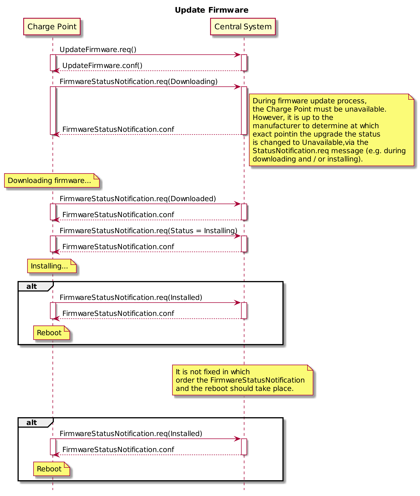

<<<
[[UseCases]]
== Use cases

===  UC.XX - Download Firmware Update +

Functional Block: FIRMWARE MANAGEMENT +

[cols="^0,2,6",options="header",]
|=======================================================================
|*No.*  | *Type* | *Description*
|*1*    | *Use case element name*  | Download Firmware Update
|*2*    | *ID*                     | UC.XX
|*3*    | *Objective(s)*           | When a Charge Point is notified about new firmware, it needs to be able to download this firmware.
|*4*    | *Description*            | This use case covers how the Central System can notify a Charge Point that it needs to update its firmware.
                                     When a Charge Point is notified about new firmware, it needs to be able to download this firmware.
|       | _Actors_                 | CPO, Charge Point, Central System
|       | _Scenario description_   | *1.* The Central System notifies the Charge Point that it needs to update its firmware. +
                                     *2.* The Central System sends a <<updateFirmware.req,UpdateFirmware.req>> PDU to instruct the Charge Point
                                     to install new firmware. +
                                     *3.* Upon receipt of an <<updateFirmware.req,UpdateFirmware.req>> PDU, the Charge Point responds with a
                                     <<updateFirmware.conf,UpdateFirmware.conf>> PDU. +
                                     *4.* The Charge Point retrieves the firmware and starts installing it.
|       | _Alternative scenarios_  |
|*5*    | *Prerequisites*          | *1.* The Profile _Firmware Management_ is installed.
                                     *2.* If an firmware update is needed. +
|*6*    | *Postconditions*         | *Successful postconditions:* Successful installation of new firmware +
                                     *Failure postconditions:* Unsuccessful installation of new firmware.
|*7*    | *Sequence diagram*       |
|=======================================================================

[cols="1,2,6",options="header",]
|=======================================================================
|*8*    | *Error handling*         |
|*9*    | *Remarks*                | The Charge Point SHOULD start retrieving the firmware as soon as possible after retrieve-date. +
                                     It is recommended that the firmware is downloaded via FTP or FTPS. FTP(S) is better
                                     optimized for large binary data than HTTP. Also FTP(S) has the ability
                                     to resume downloads. In case a download is interrupted, the Charge Point
                                     can resume downloading after the part it already has downloaded. The FTP
                                     URL is of format:
                                     __ftp:__//__user__:__password__@__host__:__port__/_path_ in which the
                                     parts __user__:__password__@, :__password__ or :__port__ may be
                                     excluded. +

                                     To ensure that the correct firmware is downloaded, it is RECOMMENDED
                                     that the firmware is also digitally signed.
|*10*   | *Test cases*             | <insert relevant test cases, Paul Klapwijk>
|=======================================================================

=== UC.XX - Requirements +

[width="100%", cols="^1,^1,2,^1,3,^1,2,2",options="noheader"]
|=======================================================================
| *CH*  | *FR/NF/C* | *Precondition*                                                                 | *ID* | *Requirement definition*                                                                                                                                                          | *M/O/C* | *Rationale* | *Note*
| 3.2 | FR |                                                       | FR04.001 | The core profile of OCPP 1.6 shall be implemented.                                                                         | M     |           |
| 3.3 | FR |                                                       | FR04.002 | The Charge Point  shall inform the Central System that the charging has been stopped.                                      | M     |           |
| 3.3 | FR | If an firmware update is needed.                      | FR04.004 | The Charge Point shall be updated with new firmware.                                                                       | M     |           |
| 3.3 | FR |                                                       | FR04.005 | The Central System shall inform the Charge Point of the time at which the Charge Point can start downloading the firmware. | M     |           |
| 3.3 | FR |                                                       | FR04.006 | The Charge Point shall notify the Central System after each step as it downloads and installs the new firmware.            | M     |           |
| 4.5 | FR |                                                       | FR04.007 | The Charge Point shall send notifications to inform the Central System about the progress of the firmware update.                                                              | M |   |
| 4.5 | FR |                                                       | FR04.008 | The Charge Point shall send a F<<FirmwareStatusNotification.req, FirmwareStatusNotification.req>> PDU for informing the Central System about the progress of the downloading and installation of a firmware update. | M |   |
| 4.5 | FR | When not busy downloading/installing firmware.        | FR04.009 | The Charge Point shall only send the status Idle after receipt of a TriggerMessage for a Firmware Status Notification.                                                         | M |   |
| 4.5 | FR | Upon receipt of a FirmwareStatusNotification.req PDU. | FR04.010 | The Central System shall respond with a <<FirmwareStatusNotification.conf, FirmwareStatusNotification.conf>>.                                                                                                       | M |   |
| 5.19 | FR  |                                                     | FR04.010 | The Central System shall be able to notify a Charge Point that it needs to update its firmware.                                                                        | M     |           |
| 5.19 | FR  | _see previous requirement_                          | FR04.011 | The Central System shall send an UpdateFirmware.req PDU to instruct the Charge Point to install new firmware.                                                          | M     |           |
| 5.19 | FR  | _see previous requirement_                          | FR04.012 | The PDU shall contain a date and time after which the Charge Point is allowed to retrieve the new firmware and the location from which the firmware can be downloaded. | M     |           |
| 5.19 | FR  | Upon receipt of an <<UpdateFirmware.req, UpdateFirmware.req>> PDU. | FR04.013 | The Charge Point shall respond with a <<updateFirmware.conf,UpdateFirmware.conf>> PDU                                                                                                          | M     |           |
| 5.19 | FR  | _see previous requirement_                          | FR04.013 | The Charge Point shall start retrieving the firmware as soon as possible after retrieve-date.                                                                          | C     |           |
|=======================================================================
| 3.3 | C  | if the presented idTag is the same as the idTag presented to start the transaction. | C04.001 | The Charge Point shall not send an Authorize.req before stopping a transaction if the                                      | N     |           |
|=======================================================================

<<<
[[Messages]]
== Messages

[[updatefirmware.req]]
=== UpdateFirmware.req
This contains the field definition of the UpdateFirmware.req PDU sent by
the Central System to the Charge Point.
See also <<update-firmware>>

[cols=",,,",options="header",]
|=======================================================================
|*Field Name* |*Field Type* |*Card.* |*Description*
|*location* |anyURI |1..1 |Required. This contains a string containing a
URI pointing to a location from which to retrieve the firmware.

|*retries* |integer |0..1 |Optional. This specifies how many times Charge
Point must try to download the firmware before giving up. If this field is
not present, it is left to Charge Point to decide how many times it wants
to retry.

|*retrieveDate* |dateTime |1..1 |Required. This contains the date and
time after which the Charge Point must retrieve the (new) firmware.

|*retryInterval* |integer |0..1 |Optional. The interval in seconds after
which a retry may be attempted. If this field is not present, it is left
to Charge Point to decide how long to wait between attempts.
|=======================================================================

[[updatefirmware.conf]]
=== UpdateFirmware.conf
This contains the field definition of the UpdateFirmware.conf PDU sent
by the Charge Point to the Central System in response to a
<<updatefirmware.req,UpdateFirmware.req>> PDU.
See also <<update-firmware>>

No fields are defined.

[[firmwarestatusnotification.req]]
=== FirmwareStatusNotification.req
This contains the field definition of the FirmwareStatusNotifitacion.req PDU sent by
the Charge Point to the Central System.
See also <<firmware-status-notification>>

[cols=",,,",options="header",]
|=======================================================================
|*Field Name* |*Field Type* |*Card.* |*Description*
|*status* |<<firmwarestatus,FirmwareStatus>> |1..1 |Required. This contains the progress
status of the firmware installation.
|=======================================================================

[[firmwarestatusnotification.conf]]
=== FirmwareStatusNotification.conf
This contains the field definition of the FirmwareStatusNotification.conf PDU sent
by the Central System to the Charge Point in response to a
<<firmwarestatusnotification.req,FirmwareStatusNotification.req>> PDU.
See also <<firmware-status-notification>>

No fields are defined.

<<<
[[DataTypes]]
== DataTypes

[[firmwarestatus]]
=== FirmwareStatus
_Enumeration_

Status of a firmware download as reported in
<<firmwarestatusnotification.req,FirmwareStatusNotification.req>>.

[cols=",",options="header",]
|=======================================================================
|*Value* |*Description*
|*Downloaded* |New firmware has been downloaded by Charge Point.
|*DownloadFailed* |Charge point failed to download firmware.
|*Downloading* |Firmware is being downloaded.
|*Idle*| Charge Point is not performing firmware update related tasks. Status Idle SHALL only be used as in a
<<firmwarestatusnotification.req,FirmwareStatusNotification.req>> that was triggered by a <<triggermessage.req,TriggerMessage.req>>
|*InstallationFailed* |Installation of new firmware has failed.
|*Installing* |Firmware is being installed.
|*Installed* |New firmware has successfully been installed in charge
point.
|=======================================================================

<<<
[[ConfigurationKeys]]
== Configuration Keys

<<CHECK>>
