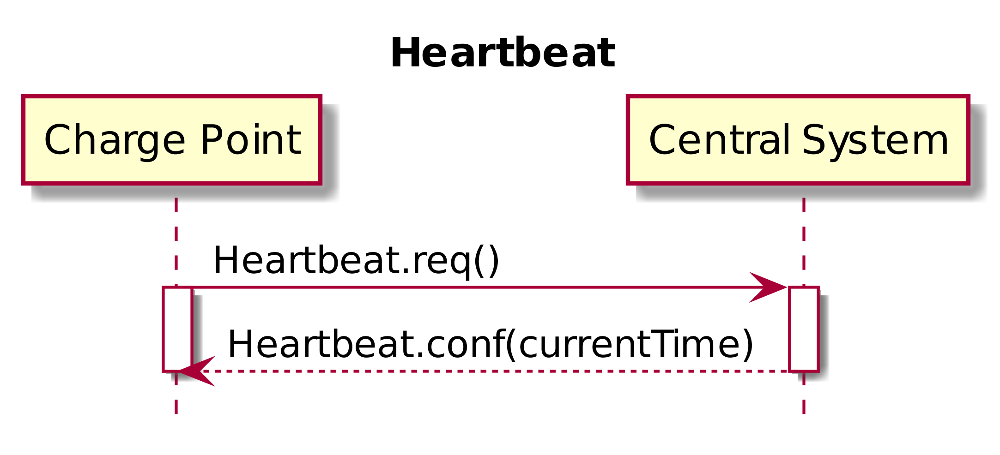

<<<
[[UseCases]]
== <Use cases>

===  UC.XX - Heartbeat +

Functional Block: Generic

[cols="^0,2,6",options="header",]
|=======================================================================
|*No.*  | *Type* | *Description*
|*1*    | *Use case element name*  | Heartbeat
|*2*    | *ID*                     | UC.XX
|*3*    | *Objective(s)*           | To let the Central System know that a Charge Point is still connected, a
                                     Charge Point sends a heartbeat after a configurable time interval.
|*4*    | *Description*            | This use case describes the possibility to ensuring for the Central System that a Charge Point is still alive.
|       | _Actors_                 | Charge Point, Central System
|       | _Scenario description_   |
                                      *1.* The Charge Point sends a <<heartbeat.req,Heartbeat.req>> PDU
                                      for ensuring that the Central System knows that a Charge Point is still
                                      alive. +
                                      *2.* Upon receipt of a <<heartbeat.req,Heartbeat.req>> PDU, the Central System responds
                                      with a <<heartbeat.conf,Heartbeat.conf>>. The response PDU
                                      contains the current time of the Central System, which is RECOMMENDED to be used by the Charge Point to
                                      synchronize its internal clock.
|       | _Alternative scenarios_  |
|*5*    | *Prerequisites*          | The _Core Profile_ is installed. +
                                     The heartbeat interval is set.
|*6*    | *Postconditions*         | *Successful postconditions:*: +
                                     The Heartbeat is received, the Charge Point is _alive_. +
                                     *Failure postconditions:* +
                                     The Heartbeat is _not_ received, the Charge Point is _offline_.
|*7*    | *Sequence diagram*       |
|=======================================================================

[cols="^0,2,6",options="header",]
|=======================================================================
|*8*    | *Error handling*         |
|*9*    | *Remarks*                |  The Charge Point MAY skip sending a <<heartbeat.req,Heartbeat.req>> PDU when another PDU has
                                      been sent to the Central System within the configured heartbeat
                                      interval. This implies that a Central System SHOULD assume availability
                                      of a Charge Point whenever a PDU has been received, the same way as it
                                      would have, when it received a <<heartbeat.req,Heartbeat.req>> PDU. +
                                      *[NOTE]* +
                                      With JSON over WebSocket, sending heartbeats is not mandatory. However, for time synchronization
                                      it is advised to at least send one heartbeat per 24 hour.
|*10*   | *Test cases*             |  <insert relevant test cases, Paul Klapwijk>

|=======================================================================

=== UC.XX - Requirements +

[width="100%", cols="^1,^1,2,^1,3,^1,2,2",options="noheader"]
|=======================================================================
| *CH*  | *FR/NF/C* | *Precondition*     | *ID* | *Requirement definition*    | *M/O/C* | *Rationale* | *Note*
| 4.2 | FR | When the Central System responds with a <<BootNotification.conf, BootNotification.conf>> with a status _Accepted_. |   | The Charge Point shall adjust the heartbeat interval in accordance with the interval from the response PDU. | M | |
| 4.6 | FR| |    | The Charge Point shall send a heartbeat after a configurable time interval.  | M     | To let the Central System know that a Charge Point is still connected,     |
| 4.6 | FR| |    | The Charge Point shall send a <<heartbeat.req,Heartbeat.req>> PDU.     | M     | To ensure that the Central System knows that a Charge Point is still alive.     |
| 4.6 | FR  |     Upon receipt of a <<heartbeat.req,Heartbeat.req>> PDU.     |    | The Central System shall respond with a <<heartbeat.conf,Heartbeat.conf>>   | M  |    |
| 4.6 | FR  |    |    | The response PDU shall contain the current time of the Central System. | M     | which is RECOMMENDED to be used by the Charge Point to synchronize its internal clock. |
| 4.6 | FR  | When another PDU has been sent to the Central System within the configured heartbeat interval. |    | The Charge Point shall skip sending a <<heartbeat.req,Heartbeat.req>> PDU.   | O  |    |
| 4.6 | FR  | Whenever a PDU has been received.  |    | The Central System SHOULD assume availability of a Charge Point. | S  |    | The same way as it would have, when it received a <<heartbeat.req,Heartbeat.req>> PDU.
|=======================================================================

<<<
[[Messages]]
== Messages

[[heartbeat.req]]
=== Heartbeat.req
This contains the field definition of the Heartbeat.req PDU sent by the
Charge Point to the Central System.
See also <<heartbeat>>

No fields are defined.

[[heartbeat.conf]]
=== Heartbeat.conf
This contains the field definition of the Heartbeat.conf PDU sent by the
Central System to the Charge Point in response to a <<heartbeat.req,Heartbeat.req>> PDU.
See also <<heartbeat>>

[cols=",,,",options="header",]
|=======================================================================
|*Field Name* |*Field Type* |*Card.* |*Description*
|*currentTime* |dateTime |1..1 |Required. This contains the current time
of the Central System.
|=======================================================================

<<<
[[DataTypes]]
== DataTypes

No fields are defined.

<<<
[[ConfigurationKeys]]
== Configuration Keys

No fields are defined.
