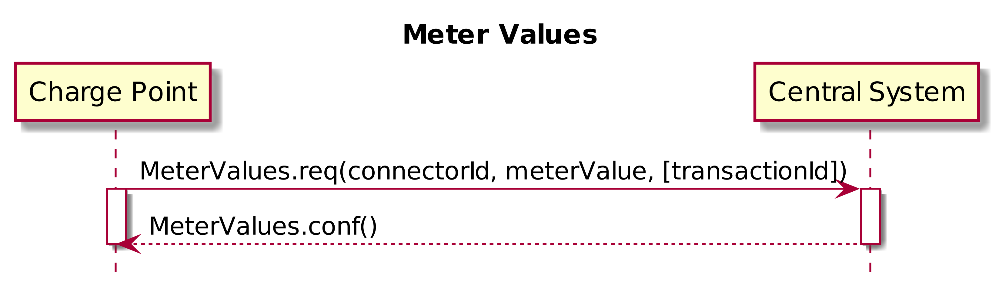

<<<
[[UseCases]]
== Meter Values

===  UC.XX - Meter Values

Functional Block: Generic

[cols="^0,2,6",options="header",]
|=======================================================================
|*No.*  | *Type*                   | *Description*
|*1*    | *Use case element name*  | Meter Values
|*2*    | *ID*                     | UC.XX
|*3*    | *Objective(s)*           | A Charge Point samples the energy meter or other sensor/transducer hardware to provide extra information about its meter values.
|*4*    | *Description*            | It is up to the Charge Point to decide when it will send meter values.
|       | _Actors_                 | Charge Point, Central System
|       | _Scenario description_   |
                                      *1.* The Charge Point sends a <<metervalues.req, MeterValues.req>> PDU for offloading meter values. +
                                      *2.* Upon receipt of a <<MeterValues.req,MeterValues.req>> PDU, the Central System responds with a <<meterValues.conf, MeterValues.conf>> +
                                      *3.* The Central System applies sanity checks to the data contained in a <<metervalues.req,MeterValues.req>> it received.
|       | _Alternative scenarios_  |
|*5*    | *Prerequisites*          | *1.*  Meter values are supported.
                                     *2.* Each <<metervalue,MeterValue>> element contains a timestamp and a set of one or more
                                      individual <<sampledvalue,sampledvalue>> elements, all captured at the same point in time. +
                                     *3.* Each <<sampledvalue,sampledValue>> element contains a single value datum. The nature of each *sampledValue* is determined by the optional <<measurand,measurand>>, <<readingcontext,context>>,
                                      <<location,location>>, <<unitofmeasure,unit>>, <<phase,phase>>, and <<valueformat,format>> fields.
|*6*    | *Postconditions*         | *Successful postcondition:* +

                                     *Failure postcondition:* +
                                      Failing Failing to respond with a <<meterValues.conf, MeterValues.conf>> will only cause the Charge Point to try the same message again as specified in Error responses to transaction-related messages.
|*7*    | *Sequence diagram*       |
|=======================================================================

[cols="^0,2,6"]
|=======================================================================
|*8*    | *Error handling*         | Insert Unhappy flows?
|*9*    | *Remarks*                | The phase field is not applicable to all <<measurand,Measurands>>. +
                                      Two measurands (_Current.Offered_ and _Power.Offered_) are available that are strictly speaking no measured values. They indicate the maximum amount of current/power that is being offered to the EV and are intended for use in smart charging applications.
|*10*   | *Test cases*             |  <insert relevant test cases, Paul Klapwijk>
|=======================================================================

=== UC.XX - Requirements +

[width="100%", cols="^1,^1,2,^1,3,^1,2,2",options="noheader"]
|=======================================================================
| *CH*  | *FR/NF/C* | *Precondition* | *ID* | *Requirement definition*                          | *M/O/C* | *Rationale*                   | *Note*|
| 4.7 | FR      |      | FR.XX.001    | The Charge Point shall sample the energy meter  to provide extra information about its meter values.                              | M     |                             | Or other sensor/transducer hardware,        |
| 4.7 | FR      |      | FR.XX.002   | The Charge Point shall send a MeterValues.req PDU for offloading meter values.            | M     |                             |     |
| 4.7 | FR      |      |FR.XX.003    | The request PDU shall contain the id of the Connector from which samples were taken.      | M     |                             |     |
| 4.7 | FR      |      |FR.XX.004   | The request PDU shall contain the transactionId of the transaction to which these values are related,                             | M     |                             |     |
| 4.7 | FR      |      If there is no transaction in progress or if the values are taken from the main meter. |FR.XX.005  | The transaction id shall be omitted.            | O     |                             |     |
| 4.7 | FR      |      Taken at a particular point in time.         |FR.XX.006   | The request PDU shall contain one or more meterValue elements, of type MeterValue.        | M     | Each representing a set of one or more data values.                 |     |
| 4.7 | FR      |      If all captured at the same point in time.   |FR.XX.007    | Each MeterValue element shall contain a timestamp and a set of one or more individual sampledvalue elements.                      | M     |                             |     |
| 4.7 | FR      |      |FR.XX.008    | Each sampledValue element hall contain a single value date.                               | M     |                             |     |
| 4.7 | FR      |      |FR.XX.009    | The nature of each sampledValue shall be determined by the optional measurand, context, location, unit, phase, and format fields. | M     |                             |     |
| 4.7 | FR      |      |FR.XX.010    | The optional measurand field shall specify the type of value being measured/reported.     | M     |                             |     |
| 4.7 | FR      |      |FR.XX.011    | The optional context field shall specify the reason/event triggering the reading.         | M     |                             |     |
| 4.7 | FR      |      |FR.XX.012    | The optional location field shall specify where the measurement is taken.                 | M     |                             | (e.g. Inlet, Outlet).                       |
| 4.7 | FR      |      |FR.XX.013    | The optional phase field shall specify to which phase or phases of the electric installation the value applies.                   | M     |                             |     |
| 4.7 | FR      |      |FR.XX.014    | The Charging Point shall report all phase number dependant values from the power meter    | M     |                             |     |
| 4.7 | FR      |      |FR.XX.015    | The Charging Point shall report all phase number dependant (or grid connection when absent) point of view.                        | M     |                             |     |
| 4.7 | FR      |      |FR.XX.016    | The Central System shall query the ConnectorPhaseRotation configuration key on the Charging Point via GetConfiguration.           | O     | For individual connector phase rotation information.                | Possible values per connector are: NotApplicable, Unknown, RST, RTS, SRT, STR, TRS and TSR. see section Standard Configuration Key Names & Values for more information. |
| 4.7 | FR      |      |FR.XX.017    | The Charge Point shall report the phase rotation in respect to the grid connection        | M     |                             |     |
| 4.7 | FR      |      |FR.XX.018    | The EXPERIMENTAL optional format field shall specify whether the data is represented in the normal (default) form as a simple numeric value ("Raw").                        | O     |                             | This experimental field may be deprecated and subsequently removed in later versions, when a more mature solution alternative is provided.                              |
| 4.7 | FR      |      |FR.XX.019    | The EXPERIMENTAL optional format field shall specify whether the data is represented as “SignedData”, an opaque digitally signed binary data block, represented as hex data | O     |                             | This experimental field may be deprecated and subsequently removed in later versions, when a more mature solution alternative is provided.                              |
| 4.7 | FR      |      |FR.XX.020    | The value without any additional fields will be interpreted, as a register reading of active import energy in Wh (Watt-hour) units.                                         | M     | To retain backward compatibility, the default values of all of the optional fields on a sampledValue element. |     |
| 4.7 | FR      | Upon receipt of a MeterValues.req PDU.       |FR.XX.021    | The Central System shall respond with a MeterValues.conf.                                 | M     |                             |     |
| 4.7 | FR      |      |FR.XX.022    | The Central System shall apply sanity checks to the data contained in a MeterValues.req it received.                              | M     |                             | The outcome of such sanity checks SHOULD NOT ever cause the Central System to not respond with a MeterValues.conf.            |
| 4.7 | FR      |      |FR.XX.023    | Failing to respond with a MeterValues.conf shall only cause the Charge Point to try the same message again as specified in Error responses to transaction-related messages. | M     |                             |     |
|=======================================================================

<<<
[[Messages]]
== Messages

[[metervalues.req]]
=== MeterValues.req
This contains the field definition of the MeterValues.req PDU sent by
the Charge Point to the Central System.
See also <<meter-values>>

[cols=",,,",options="header",]
|=======================================================================
|*Field Name* |*Field Type* |*Card.* |*Description*
|*connectorId*| integer connectorId >= 0 |1..1 |Required. This contains
a number (>0) designating a connector of the Charge Point.‘0’ (zero)
is used to designate the main powermeter.
|*transactionId* |integer |0..1 |Optional. The transaction to which
these meter samples are related.
|*meterValue* |<<metervalue,MeterValue>> |1..* |Required. The sampled meter values with
timestamps.
|=======================================================================

[[metervalues.conf]]
=== MeterValues.conf
This contains the field definition of the MeterValues.conf PDU sent by
the Central System to the Charge Point in response to a <<metervalues.req,MeterValues.req>>
PDU.
See also <<meter-values>>

<<<
[[DataTypes]]
== DataTypes

[[measurand]]
=== Measurand
_Enumeration_

Allowable values of the optional "measurand" field of a Value
element, as used in <<metervalues.req,MeterValues.req>> and
<<stoptransaction.req,StopTransaction.req>> messages. Default value
of "<<measurand,measurand>>" is always "Energy.Active.Import.Register"

[cols=",",options="header",]
|=======================================================================
|*Value* |*Description*
|*Current.Export* |Instantaneous current flow from EV
|*Current.Import* |Instantaneous current flow to EV
|*Current.Offered* |Maximum current offered to EV
|*Energy.Active.Export.Register* |Energy exported by EV (Wh or kWh)
|*Energy.Active.Import.Register* |Energy imported by EV (Wh or kWh)
|*Energy.Reactive.Export.Register* |Reactive energy exported by EV (varh
or kvarh)
|*Energy.Reactive.Import.Register* |Reactive energy imported by EV (varh
or kvarh)
|*Energy.Active.Export.Interval* |Energy exported by EV (Wh or kWh)
|*Energy.Active.Import.Interval* |Energy imported by EV (Wh or kWh)
|*Energy.Reactive.Export.Interval* |Reactive energy exported by EV.
(varh or kvarh)
|*Energy.Reactive.Import.Interval* |Reactive energy imported by EV.
(varh or kvarh)
|*Frequency*| Instantaneous reading of powerline frequency
|*Power.Active.Export* |Instantaneous active power exported by EV. (W or
kW)
|*Power.Active.Import* |Instantaneous active power imported by EV. (W or
kW)
|*Power.Factor*|Instantaneous power factor of total energy flow
|*Power.Offered* |Maximum power offered to EV
|*Power.Reactive.Export* |Instantaneous reactive power exported by EV.
(var or kvar)
|*Power.Reactive.Import* |Instantaneous reactive power imported by EV.
(var or kvar)
|*RPM*| Fan speed in RPM
|*SoC*|State of charge of charging vehicle in percentage
|*Temperature* |Temperature reading inside Charge Point.
|*Voltage* |Instantaneous AC RMS supply voltage
|=======================================================================

[[metervalue]]
=== MeterValue
_Class_

Collection of one or more sampled values in <<metervalues.req,MeterValues.req>>.
All sampled values in a MeterValue are sampled at the same point in time.

[cols=",,,,",options="header",]
|=======================================================================
|*Field Name* |*Field Type* |*Card.* |*Description*
|*timestamp* |dateTime |1..1 |Required. Timestamp for measured value(s).
|*sampledValue* | <<sampledvalue,SampledValue>> | 1..* | Required. One or more measured values
|=======================================================================

[[sampledvalue]]
=== SampledValue
_Class_

Single sampled value in <<metervalue,MeterValues>>.
Each value can be accompanied by optional fields.

[cols=",,,,",options="header",]
|=======================================================================
|*Field Name* |*Field Type* |*Card.* |*Description*
|*value*|String |1..1 |Required. Value as a “Raw” (decimal) number or “SignedData”.
Field Type is “string” to allow for digitally signed data readings. Decimal numeric
values are also acceptable to allow fractional values for measurands
such as Temperature and Current.
|*context* |<<readingcontext,ReadingContext>> |0..1 |Optional. Type of detail value: start,
end or sample. Default = “Sample.Periodic”
|*format* |<<valueformat,ValueFormat>> |0..1 |Optional. Raw or signed data. Default =
“Raw”
|*measurand* |<<measurand,Measurand>> |0..1 |Optional. Type of measurement. Default =
“Energy.Active.Import.Register”
|*phase*|<<phase,Phase>> | 0..1 | Optional. indicates how the measured value is to be interpreted. For instance between L1 and neutral (L1-N)
Please note that not all values of phase are applicable to all <<measurand,Measurand>>s. When phase is absent, the measured value is interpreted as an overall value.
|*location* |<<location,Location>> |0..1 |Optional. Location of measurement.
Default=”Outlet”
|*unit* |<<unitofmeasure,UnitOfMeasure>> |0..1 |Optional. Unit of the value. Default = “Wh”
if the (default) measurand is an “Energy” type.
|=======================================================================

<<<
[[ConfigurationKeys]]
== Configuration Keys

<<CHECK
